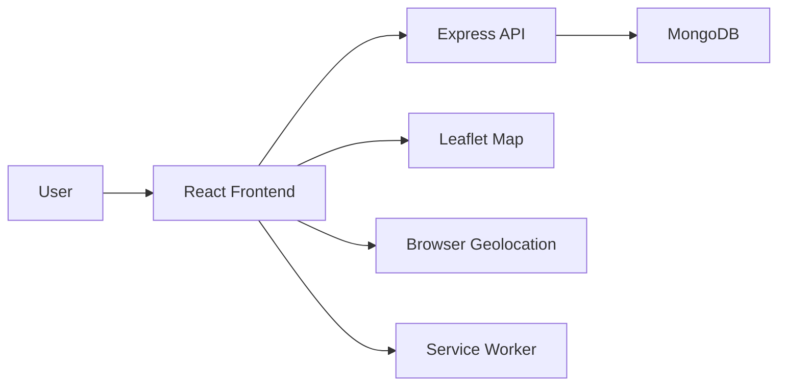
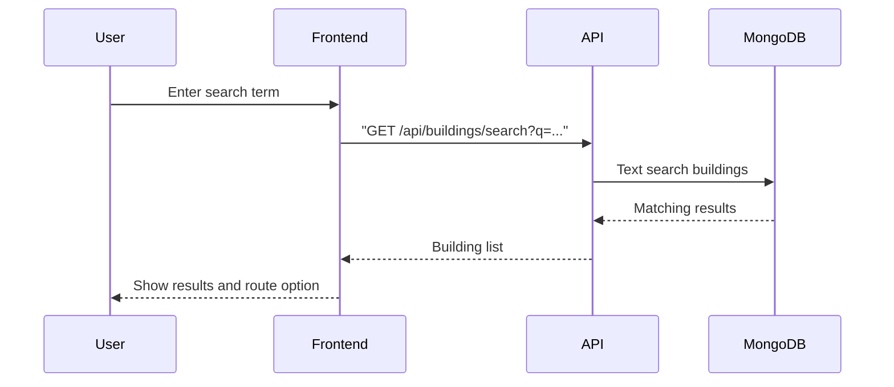
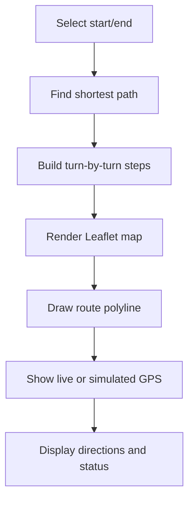
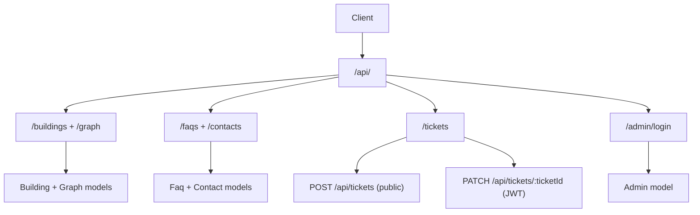
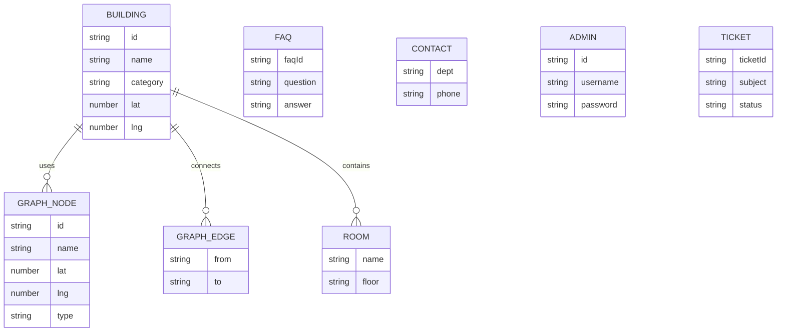
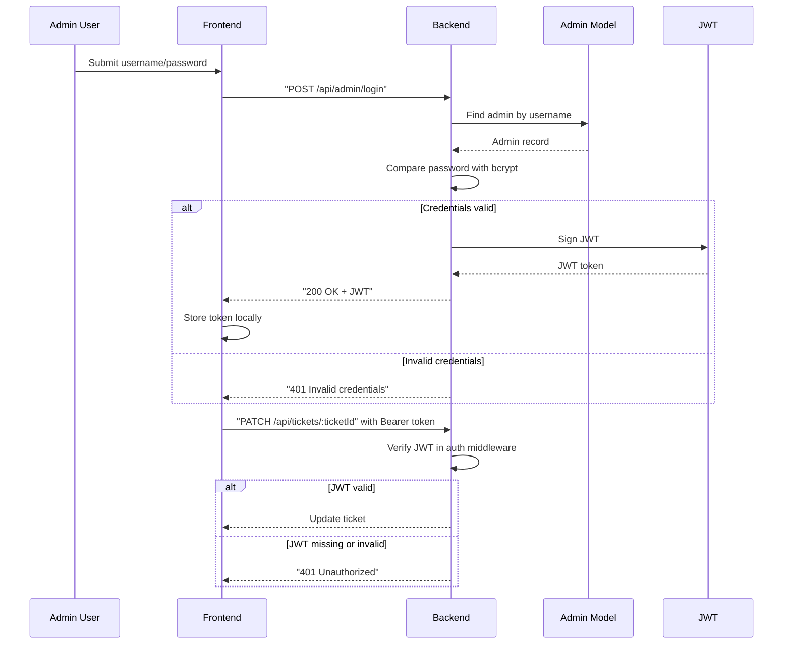

# GCTU Campus Navigator Diagrams

## 1. High-level architecture

## 2. Campus search flow

## 3. Map rendering and navigation flow

## 4. Backend API route structure

## 5. Database schema

The schema now includes an Admin collection for backend authentication.

## 6. Auth flow

